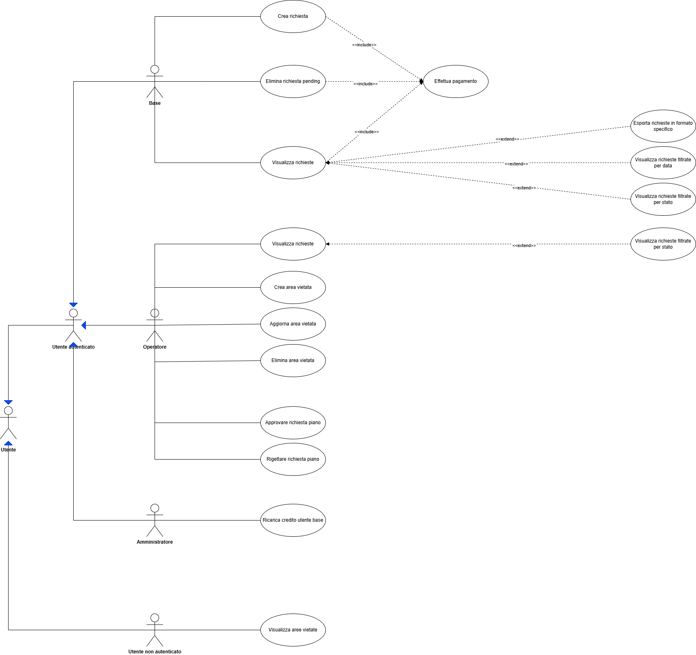

# Backend per gestione navigazione marina autonoma

Realizzazione di un backend per sostenere l'esame pratico di Programmazione avanzata (A.A 2024/2025) del corso di Laurea Magistrale
in Ingegneria Informatica e dell'Automazione (LM-32) tenuto presso l'Università Politecnica delle Marche.

1. [🎯 Obiettivo del Progetto](#-obiettivo-del-progetto)
2. [🏗 Progettazione](#-progettazione)
   - [Casi d'Uso](#casi-duso)
   - [Diagrammi di Sequenza](#diagrammi-di-sequenza)
3. [🧩 Design Pattern Utilizzati](#-design-pattern-utilizzati)
4. [🛠 Tecnologie Utilizzate](#-tecnologie-utilizzate)
5. [🐳 Avvio del Progetto (Docker)](#-avvio-del-progetto-docker)
   - [Configurazione Ambiente](#configurazione-ambiente)
   - [Comandi per l'Esecuzione](#comandi-per-lesecuzione)
6. [🧪 Test del Progetto](#-test-del-progetto)
   - [Test Middleware (Jest)](#test-middleware-jest)
   - [Test API (Postman/Curl)](#test-api-postmancurl)

## 🎯 Obiettivo del Progetto

L'obiettivo del progetto è lo sviluppo di un sistema backend che consenta di gestire diversi aspetti
che riguardano la navigazione marina autonoma, al fine di dimostrare di aver compreso 
i concetti e le buone pratiche illustrate nel corso.

In generale, il sistema deve poter essere in grado di gestire gli aspetti di:
- prenotazione di navigazione marina a fronte di un pagamento nel sistema di credito interno;
- visualizzazione e cancellazione di richieste/piani di navigazione;
- visualizzazione, creazione, modifica e cancellazione di aree di navigazione proibite;
- ricarica dei token utente;

Il backend deve prevedere quattro tipologie diverse di utente.
Ogni utenza è deputata alla gestione di uno degli aspetti dell'applicazione sopra citati.
Al fine di permettere al backend di autenticare le diverse utenze, occorre che esso sia dotato
di un sistema di autenticazione basato sul token JWT.

In particolare, le utenze e le relative funzionalità ad esse permesse all'interno dell'applicazione sono:
- **Utenza non autenticata**:
    - può autenticarsi;
    - visualizzare tutte le zone proibite di navigazione, sia quelle attive che non;
- **Utenza autenticata**:
    - utente (user):
        - può creare piani di navigazione a patto che:
            - abbia credito disponibile;
            - la data inizio del piano sia maggiore di 48h rispetto alla data di sottomissione della richiesta;
            - i punti della rotta non si trovino all'interno di aree vietate attive;
            - non ci siano piani di navigazione dello stesso utente che siano approvati/pending nello stesso periodo di quello oggetto della richiesta;
        - può cancellare piani di navigazione in stato di pending a patto che siano i suoi;
        - può visualizzare le proprie richieste/piani di navigazione in formato standard/JSON/XML filtrando eventualmente per
            - per data inizio navigazione;
            - per data fine navigazione;
            - per stato richiesta/piano di navigazione;
    - operatore (operator):
        - può approvare un piano di navigazione a patto che non si trovi già in stato di accepted/rejected/cancelled;
        - può rigettare un piano di navigazione a patto che non si trovi già in stato di accepted/rejected/cancelled;
        - può creare una zona di navigazione probita a patto che la sua rotta non confligga con una zona già presente;
        - può modificare zone di navigazione proibita;
        - può cancellare zone di navigazione proibita da esso create (non degli altri operatori); 
    - amministratore (admin):
        - può ricaricare i token di uno specifico utente (user) di una certa quantità.

A livello tecnologico, il backend deve essere sviluppato in **Typescript**, facendo utilizzo dei framework:
- **Express**: libreria per lo sviluppo di Web Applications e APIs;
- **Sequelize**: libreria **ORM** che permette il mapping di oggetti Typescript a oggetti fisici. (tabelle database)

Essendo l'RDBMS a scelta libera, il database utilizzato dal corrente progetto è **PostgreSQL**.

---
## 🧩 Design Pattern Utilizzati
Per garantire robustezza e manutenibilità, il progetto implementa i seguenti pattern:

* MVC - Model-View-Controller
* CoR - Chain of Responsibility
* Simple Factory
* Service Layer
* DAO - Data Access Object
* Singleton

### MVC - Model-View-Controller 
Il Design Pattern MVC introduce tre componenti, ognuna dedicata a uno scopo diverso.
La View ha lo scopo di effettuare il rendering della UI, il Controller risponde alle azioni che vengono effettuate sulla UI e il modello si occupa della logica di business e della gestione dello stato.

Nel backend in questione il design pattern MVC è stato implementato nella seguente maniera:
* **Model**: rappresentato da modelli Sequelize e interfacce dedicate alla rappresentazione delle entità di dominio; (navplans, nonavzone, users, ecc...)
* **Controller**: utilizzato per il recupero delle entità di dominio, parametri, query string presenti all'interno della richiesta HTTP per poi fare riferimento al Service Layer per le elaborazioni più legate alla logica applicativa. Al ritorno delle informazioni da parte di quest'ultimo, si occupa di produrre la Response HTTP in maniera appropriata rispetto alla rotta di provenienza. 
I controller sono stati suddivisi sostanzialmente per ruoli, tranne per quanto riguarda il controller nominato UserOpRoleController che implementa una funzionalità parzialmente condivisa tra due livelli di utenza.
* **View**: la view, essendo il progetto consistente in un backend, è rappresentata dalla struttura delle risorse in ingresso e in uscita al controller, veicolate per il tramite dell'interfaccia HTTP;

### CoR - Chain of Responsibility
CoR è un design pattern di tipo comportamentale che consente che una richiesta possa essere gestita da diversi gestori, ognuno specializzato nel proprio compito da svolgere su di essa.

CoR è stato implementato nei Middleware all'interno dell'applicazione, in particolare nei:
- Middleware di autenticazione: un esempio di Middleware di questo tipo è la `verifyJwt` all'interno del file `auth_middlewares.ts` nel repository corrente, che va a verificare la presenza e la validità del token JWT di autenticazione fornito dall'utente.
- Middleware di autorizzazione: un esempio di Middleware di questo tipo è la `checkRole` all'interno del file `auth_middlewares.ts`, che va a verificare il ruolo dell'utente autenticato contenuto all'interno del payload jwt. 
- Middleware di validazione e sanificazione: un esempio di Middleware di questo tipo è la `finalizeDelNavPlanReq` all'interno del file `navplan_middlewares.ts`, che consente di estrarre gli errori prodotti dalla catena di validazione dei middleware di validazione precedente o i dati validati.
- Middleware di gestione centralizzata errori: un esempio di Middleware di questo tipo è l'`errorHandler` definito all'interno del file `error_middlewares.ts`, che consente di individuare l'istanza dell'errore lanciato da Middleware/Controller presenti in un punto precedente della catena di responsabilità, affinchè esso possa generare una risposta HTTP appropriata. 

### Simple Factory
Factory è un design pattern creazionale che fornisce una interfaccia per creare oggetti in una superclasse, permettendo alle sottoclassi di modificare il tipo di oggetto che verrà creato.

L'implementazione presente nel backend, può essere ricondotta più a una Simple Factory, ossia una classe statica con un metodo statico che genera oggetti custom a seconda dei valori degli argomenti passati.
Su segnalazione di errore di ESLint sulle classi statiche, si è scelto di implementare una funzione esportata che prende come argomento il nome dell'errore applicativo (o del nome dell'operazione avvenuta con successo) affinchè essa generi una risposta HTTP adeguata ad esso. (nel caso degli errori, statusCode e message coerenti con il nome dell'errore)
Queste funzioni factory (`errorFactory` e `successFactory`) fanno riferimento a dei Record Typescript in cui è contenuta la struttura del messaggio HTTP che deve essere prodotta dalle Factory.  

### Service Layer
Il Service Layer serve per astrarre la logica di business dalla logica di persistenza dei dati.
Solitamente infatti, rappresenta il layer più lontano rispetto alla persistenza dei dati dopo Repository e DAO.

Si è scelto di implementare il Service Layer e non il Repository per semplificare la struttura dell'architettura.
L'implementazione consiste in una classe a cui vengono iniettati i DAO di cui necessita per accedere alla persistenza dei dati e implementare le logiche di business.
Qui, diversamente dai controller, si è implementato una classe per ogni utenza applicativa. (es. user `UserRoleService`, operator `OperatorRoleService`, ecc...)

### DAO - Data Access Object
Il DAO viene utilizzato per l'astrazione delle operazioni di persistenza e per separare la logica di business da quella dell'accesso diretto ai dati.

Nel progetto ciò viene implementato attraverso le classi `NavPlanDAO`, `UserDAO` e `NoNavZoneDAO`.
Queste tre classi implementano un'interfaccia comune generica che stabilisce quali sono i metodi obbligatori e facoltativi, con i relativi argomenti e tipi di ritorno.
Inoltre, esse, alla loro istanziazione effettuano un test di autenticazione sul Database e valorizzano la proprietà privata interna dedicata alla memorizzazione del corrispondente modello Sequelize ritornato da un metodo statico della classe `OrmModels`.
### Singleton
Singleton è un design pattern creazionale che permette che l'istanza di una classe sia condivisa per tutte le componenti che ne necessitano nell'applicazione.

Il pattern è implementato all'interno del backend per quanto riguarda l'istanza di Sequelize che consente l'interfacciamento dell'applicazione web con il database.
In particolare la classe statica `SingletonDBConnection` è dotata di un metodo `getInstance` che controlla la valorizzazione della variabile privata interna dedicata a contenere l'istanza univoca di Sequelize.
Qualora non sia valorizzata, la `getInstance` invoca il costruttore privato e ritorna l'istanza dell'oggetto `sequelize` contenuta nella variabile, altrimenti effettua soltanto questa seconda operazione.
Il costruttore privato va ad istanziare l'oggetto Sequelize e può essere chiamato soltanto passando dal metodo `getInstance`, che è chiave del funzionamento del pattern in questione.
L'oggetto `SingletonDBConnection` viene istanziato all'interno di una variabile esportata chiamata `sequelize`, di cui `OrmModels` fa utilizzo per la connessione al database.

---
##
Prima di procedere all'illustrazione della fase di progettazione, si vuole elencare le API che il backend in questione mette a disposizione.
In particolare, di seguito verranno elencate le rotte con le funzionalità e ruolo dell'utenza ad esse associate.

| Rotta                                                                                                                                    | Metodo HTTP | Ruolo autorizzato      | Descrizione                                                                                                                                                                                 |
| ---------------------------------------------------------------------------------------------------------------------------------------- | ----------- | ---------------------- | ------------------------------------------------------------------------------------------------------------------------------------------------------------------------------------------- |
| /login                                                                                                                                   | POST        | utente non autenticato | Ritorna il token JWT nell'header e tutto l'utente con messaggio di succcesso e dati utente.                                                                                                 |
| /nonavzones                                                                                                                              | GET         | utente non autenticato | Visualizzare tutte le aree vietate.                                                                                                                                                         |
| /navplans                                                                                                                                | POST        | utente                 | Crea la richiesta di autorizzazione per piano di navigazione;                                                                                                                               |
| /navplans?status=pending&date_from=01/01/2026&date_to=30/01/2026&from=2025-12-01&to=2025-12-9&format=xml<br><br>/navplans?status=pending | GET         | utente                 | Visualizza i piani di navigazione, eventualmente filtrandoli per stato di approvazione, data inizio, data fine.<br>È possibile scegliere di visualizzare i risultati in formato JSON o XML. |
| /navplans/:id<br><br>Es. /navplans/1                                                                                                     | DELETE      | utente                 | Cancellazione di una richiesta di approvazione piano di navigazione in stato di pending.                                                                                                    |
| /navplans?status=pending                                                                                                                 | GET         | operatore              | Visualizza i piani di navigazione, eventualmente filtrandoli per stato di approvazione.                                                                                                     |
| /navplans                                                                                                                                | PATCH       | operatore              | Approvare una richiesta piano di navigazione in stato di pending.                                                                                                                           |
| /navplans                                                                                                                                | PATCH       | operatore              | Rigettare una richiesta piano di navigazione fornendo una motivazione.                                                                                                                      |
| /nonavzones                                                                                                                              | POST        | operatore              | Creazione di un'area vietata.                                                                                                                                                               |
| /nonavzones/:id                                                                                                                          | PATCH       | operatore              | Aggiornamento di un'area vietata.                                                                                                                                                           |
| /nonavzones/:id                                                                                                                          | DELETE      | operatore              | Eliminazione di un'area vietata.                                                                                                                                                            |
| /users                                                                                                                                   | PATCH       | amministratore         | Ricarica                                                                                                                                                                                    |

## 🏗 Progettazione
In questa sezione vengono illustrati l'architettura logica e i flussi di sistema.
### Diagramma dei Casi d'Uso (Use Case Diagram)

### Diagrammi di Sequenza (Sequence Diagrams)


Prima di mostrare i diagrammi di sequenza, fare una tabella contente tutte le rotte e relative funzionalità.
* **Creazione e Validazione Piano**: Mostra il flusso dalla richiesta dell'utente al controllo del credito e della rotta rispetto alle zone proibite.
* **Gestione Operatore**: Flusso di approvazione o rifiuto di una richiesta di navigazione.


---


## 🐳 Avvio del Progetto (Docker)
Il sistema è predisposto per essere avviato tramite **Docker Compose** per comporre i servizi necessari.

1.  **Variabili d'Ambiente**: Creare un file `.env` basato sull'esempio fornito, inserendo la chiave privata per i token JWT (RS256).
2.  **Comando di avvio**:
    ```bash
    docker-compose up --build
    ```
3.  **Inizializzazione**: All'avvio, vengono eseguiti automaticamente gli script di **seed** per popolare il database con i ruoli predefiniti e il credito iniziale per gli utenti di test.

---

## 🧪 Test del Progetto

### Test dei Middleware (Jest)
Sono stati sviluppati test unitari tramite **Jest** per tre middleware fondamentali:

1.  **Middleware di Autenticazione**: Verifica la validità del token JWT e l'estrazione dei privilegi di ruolo.
2.  **Middleware di Controllo Credito**: Blocca le richieste se l'utente ha un saldo inferiore a 2 token.
3.  **Middleware di Validazione Rotta**: Verifica che il set di waypoint fornito non intersechi aree identificate come **zone proibite**.

Per eseguire i test: `npm test`

### Test delle API
Le funzionalità possono essere verificate tramite **Postman** o comandi **curl**:

* **Pubblico**: Consultazione delle zone di navigazione proibita.
* **Auth**: Login e gestione sessione tramite JWT.
* **Piani di Navigazione**: Sottomissione, cancellazione (se in stato *pending*) e filtraggio dello storico.
* **Esportazione**: Verifica del corretto output in formato JSON e XML.

---

## 📂 Struttura della Repository
* `/src/controllers`: Gestione delle richieste e risposte HTTP.
* `/src/services`: Logica di business core e calcoli di validazione.
* `/src/middlewares`: Filtri di sicurezza e validatori di rotta/credito.
* `/src/db`: Configurazione Sequelize, modelli e implementazione DAO.